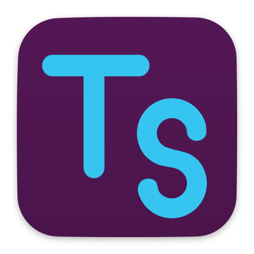

# slack-archivist



## how to set up the app

1. Go to [https://api.slack.com/apps](https://api.slack.com/apps) and create an
   app.
2. "OAuth & Permissions" > "Scopes" > "User Token Scopes" add the following:
   - `calls:read`
   - `channels:history`
   - `channels:read`
   - `files:read`
   - `groups:history`
   - `groups:read`
   - `im:history`
   - `im:read`
   - `links:read`
   - `mpim:history`
   - `mpim:read`
   - `pins:read`
   - `reactions:read`
   - `stars:read`
   - `team:read`
   - `usergroups:read`
   - `users.profile:read`
   - `users:read`
   - `users:read.email`
3. Either under "Install App" or "OAuth & Permissions", hit the button that says
   "Install to Workspace".
4. At this point, you should be presented with a user token that starts with
   `xoxp-`. Copy that and put it into the `userToken` field of the `config.json`
   file.

## export structure

```
$archiveDir
> channels.json
> $channelId
   > files.json
   > history.json
   > files
      > $fileId
         > $filename
   > messages
      > \d{4}.\d{2}.\d{2}.json
```
